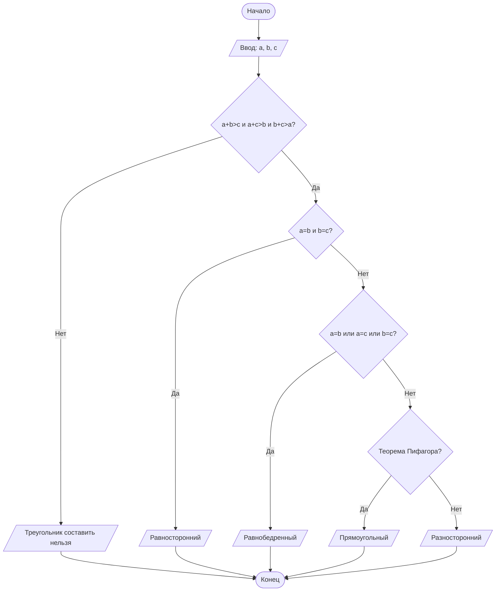

## Отчет по лабораторной работе № 1

#### № группы: `ПМ-2602`

#### Выполнил: `Колобанов Павел Алексеевич`

#### Вариант: `10`

### Cодержание:

- [Постановка задачи](#1-постановка-задачи)
- [Входные и выходные данные](#2-входные-и-выходные-данные)
- [Выбор структуры данных](#3-выбор-структуры-данных)
- [Алгоритм](#4-алгоритм)
- [Программа](#5-программа)
- [Анализ правильности решения](#6-анализ-правильности-решения)

### 1. Постановка задачи

 > Программа получает на вход три натуральных числа A, B и C, задающих длины трех отрезков. 

Данную задачу можно разделить на 2 подзадачи: проверка возможности построения треугольника и определение его типа.

- Для 1 подзадачи необходимо проверить выполнение неравенств треугольника:
    1. `A + B > C`
    2. `A + C > B`
  3. `B + C > A`
  
  В случае, когда хотя бы одно из этих условий не выполняется, треугольник составить нельзя.
- Если треугольник существует, для определения его типа нужно рассмотреть следующие случаи:
    1. `A = B = C` — равносторонний треугольник.
    2. `A = B, A = C или B = C` — равнобедренный треугольник.
  3. `A² + B² = C²`, `A² + C² = B²` или `B² + C² = A²` — прямоугольный треугольник.
  4. `Во всех остальных случаях` — разносторонний треугольник.

### 2. Входные и выходные данные

#### Данные на вход

На вход программа получает три натуральных числа `A`, `B ` и `C`. Эти числа обозначают длины трех отрезков.

|             | Тип                | min значение    | max значение   |
|-------------|--------------------|-----------------|----------------|
| A (Число 1) | Целое число | 1  | 2 147 483 647 |
| B (Число 2) | Целое число | 1 | 2 147 483 647 |
| C (Число 3) | Целое число | 1 | 2 147 483 647 |


#### Данные на выход

Программа должна вывести сообщение о том, можно ли составить треугольник.
Если треугольник составить можно, программа должна определить его тип:
* равносторонний;
* равнобедренный;
* разносторонний;
* прямоугольный.

Если составить треугольник нельзя, выводится соответствующее сообщение.

### 3. Выбор структуры данных

Программа получает три натуральных числа, поэтому для их хранения можно использовать три переменные (`a`, `b` и `c`) типа `int`.

|             | название переменной | Тип (в Java) | 
|-------------|---------------------|--------------|
| A (Число 1) | `a`                 | `int`     |
| B (Число 2) | `b`                 | `int`     | 
| C (Число 3) | `c`                 | `int`     | 


Для вывода результата необязательно его хранить в отдельной переменной.

### 4. Алгоритм

#### Алгоритм выполнения программы:

1. **Ввод данных:**  
   Программа считывает три натуральных числа, обозначенные как `a`, `b` и `c`.

2. **Проверка возможности построения треугольника:**  
   Проверяется выполнение трех неравенств:
    * `a + b > c`
    * `a + c > b`
    * `b + c > a`

   Если хотя бы одно условие не выполняется, выводится сообщение:
    * `Треугольник составить нельзя`


3. **Определение типа треугольника:**
    - Если треугольник существует, сначала проверяется равенство всех трех сторон.
    - Если `a == b` и `b == c`, то треугольник равносторонний. Затем проверяется, равны ли хотя бы две стороны: `a == b`, `a == c` или `b == c`.
   Если да, то треугольник равнобедренный.
    - Далее проверяется теорема Пифагора: `a² + b² = c²`, `a² + c² = b²`, `b² + c² = a²`. Если одно из условий выполняется, треугольник прямоугольный. 

   Во всех остальных случаях треугольник является разносторонним.


4. **Вывод результата:**  
   На экран выводится тип полученного треугольника или надпись - `Треугольник составить нельзя`.

#### Блок-схема



### 5. Программа

```java
import java.io.PrintStream;
import java.util.Scanner;

public class Main {
    // Объявляем объект класса Scanner для ввода данных
    public static Scanner in = new Scanner(System.in);
    // Объявляем объект класса PrintStream для вывода данных
    public static PrintStream out = System.out;

    public static void main(String[] args) {
        // Считываем три стороны треугольника
        int a = in.nextInt();
        int b = in.nextInt();
        int c = in.nextInt();

        // Проверяем, можно ли составить треугольник
        if (a + b <= c || a + c <= b || b + c <= a) {
            System.out.println("Треугольник составить нельзя");
        } else {
            // Проверяем, равносторонний ли треугольник
            if (a == b && b == c) {
                System.out.println("Равносторонний");
            }
            // Проверяем, равнобедренный ли треугольник
            else if (a == b || a == c || b == c) {
                System.out.println("Равнобедренный");
            }
            // Проверяем, прямоугольный ли треугольник
            else if (a * a + b * b == c * c ||
                    a * a + c * c == b * b ||
                    b * b + c * c == a * a) {
                System.out.println("Прямоугольный");
            }
            // Во всех остальных случаях треугольник разносторонний
            else {
                System.out.println("Разносторонний");
            }
        }
    }
}
```

### 6. Анализ правильности решения

Программа работает корректно на всех допустимых натуральных значениях A, B и C.

1. Тест на равносторонний треугольник:

    - **Input**:
        ```
        5 5 5
        ```

    - **Output**:
        ```
        Равносторонний
        ```

2. Тест на равнобедренный треугольник:

    - **Input**:
        ```
        5 5 3
        ```

    - **Output**:
        ```
        Равнобедренный
        ```

3. Тест на прямоугольный треугольник:

    - **Input**:
        ```
        3 4 5
        ```

    - **Output**:
        ```
        Прямоугольный
        ```

4. Тест на разносторонний треугольник:

    - **Input**:
        ```
        4 5 6
        ```

    - **Output**:
        ```
        Разносторонний
        ```

5. Тест на невозможность построения треугольника:

    - **Input**:
        ```
        2 3 6
        ```

    - **Output**:
        ```
        Треугольник составить нельзя
        ```
      
6. Тест на прямоугольный треугольник с другими сторонами:

    - **Input**:
        ```
        5 12 13
        ```

    - **Output**:
        ```
        Прямоугольный
        ```
